# Windows Server Backup vers TrueNAS CORE

## Présentation
Ce projet documente la mise en place d’une solution de sauvegarde entre un serveur Windows Server 2019 et un NAS TrueNAS CORE dans un environnement virtualisé.

L’objectif était de stocker une sauvegarde complète du serveur Windows sur un partage réseau SMB hébergé sur TrueNAS, puis de vérifier la bonne exécution de la sauvegarde ainsi que la présence effective des données côté NAS.

> Ce dépôt présente un projet documenté à partir de captures d’écran.  
> Les machines virtuelles du lab initial ne sont plus disponibles.

---

## Objectifs
- Déployer un serveur de stockage sous TrueNAS CORE
- Créer un pool ZFS en miroir
- Créer un dataset dédié à la sauvegarde
- Publier un partage SMB accessible depuis Windows Server 2019
- Installer la fonctionnalité **Sauvegarde Windows Server**
- Réaliser une sauvegarde complète du serveur vers le partage réseau
- Vérifier la présence des données côté TrueNAS

---

## Environnement technique
- **Hyperviseur** : Oracle VirtualBox
- **Serveur source** : Windows Server 2019
- **Serveur cible** : TrueNAS CORE
- **Protocole de stockage** : SMB
- **Système de fichiers côté NAS** : ZFS
- **Compression** : LZ4

## Stack technique
- Windows Server 2019
- TrueNAS CORE
- SMB / CIFS
- ZFS
- Oracle VirtualBox
- Windows Server Backup

---

## Architecture du projet
Le serveur Windows Server 2019 envoie une sauvegarde complète vers un partage SMB hébergé sur TrueNAS CORE.

### Côté TrueNAS
- création d’un pool ZFS miroir
- création d’un dataset dédié à la sauvegarde
- configuration d’un partage SMB
- définition des permissions d’accès sur le dataset

### Côté Windows Server
- installation de la fonctionnalité **Sauvegarde Windows Server**
- lancement d’une sauvegarde unique
- choix d’une sauvegarde de type **Serveur complet**
- destination : dossier partagé distant

---

## Étapes réalisées

### 1. Configuration initiale de TrueNAS
Le serveur TrueNAS a été déployé dans une machine virtuelle, puis accessible via son interface web d’administration.

### 2. Création du stockage
Un pool de stockage ZFS a été créé en mode miroir, afin d’héberger les données de sauvegarde.

### 3. Création du dataset
Un dataset dédié a ensuite été créé avec :
- compression **LZ4**
- type de partage **SMB**

### 4. Configuration du partage réseau
Le dataset a été publié via un partage SMB, avec application des permissions adaptées pour l’écriture de la sauvegarde.

### 5. Installation de Windows Server Backup
La fonctionnalité **Sauvegarde Windows Server** a été installée sur le serveur Windows Server 2019.

### 6. Lancement de la sauvegarde
Une sauvegarde unique de type **Serveur complet** a été lancée en sélectionnant comme destination un **dossier partagé distant**.

### 7. Vérification
La sauvegarde a été validée :
- côté Windows Server avec un statut **Réussite**
- côté TrueNAS avec présence des fichiers et augmentation de l’espace utilisé

---

## Résultats obtenus
Le projet a permis de valider :

- la mise en place d’un stockage de sauvegarde sur TrueNAS CORE
- la publication d’un partage SMB dédié
- l’installation et l’utilisation de Windows Server Backup
- l’envoi réussi d’une sauvegarde complète vers le NAS
- la présence effective des données sur le partage réseau
- l’occupation du stockage visible côté TrueNAS

Une sauvegarde d’environ **20,70 Go** a été transférée avec succès vers le partage distant.

---

## Captures d’écran

### Création du pool ZFS miroir
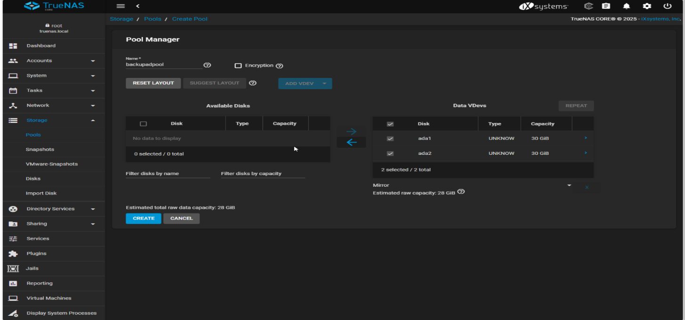

### Pool créé et opérationnel
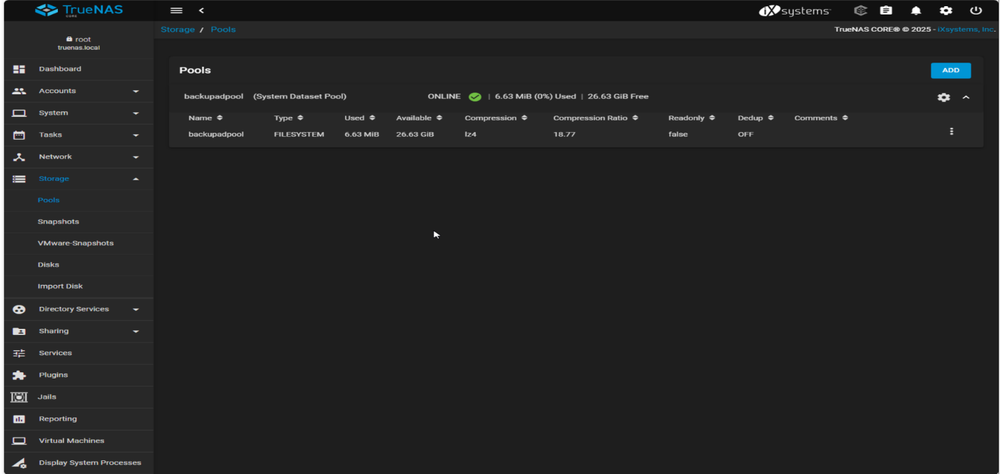

### Création du dataset de sauvegarde
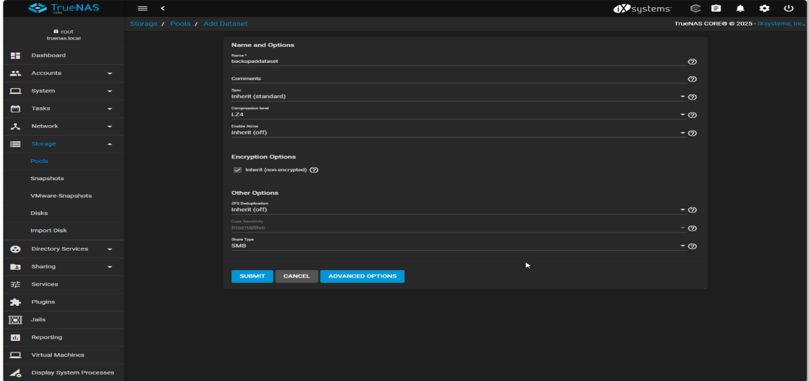

### Dataset créé
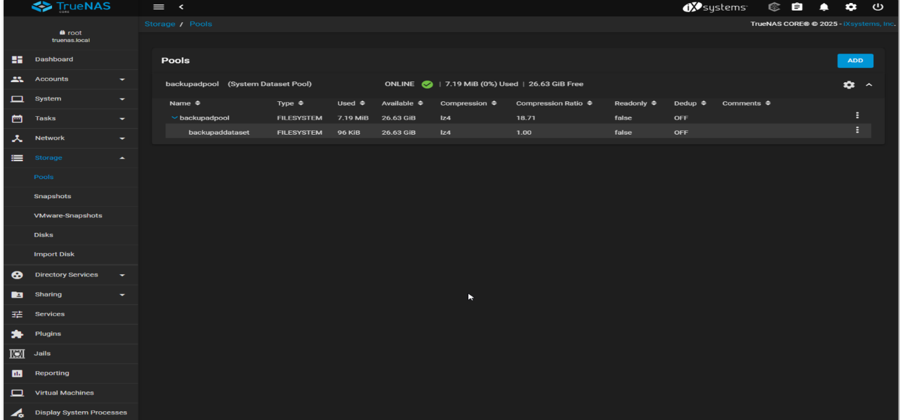

### Permissions ACL sur le dataset
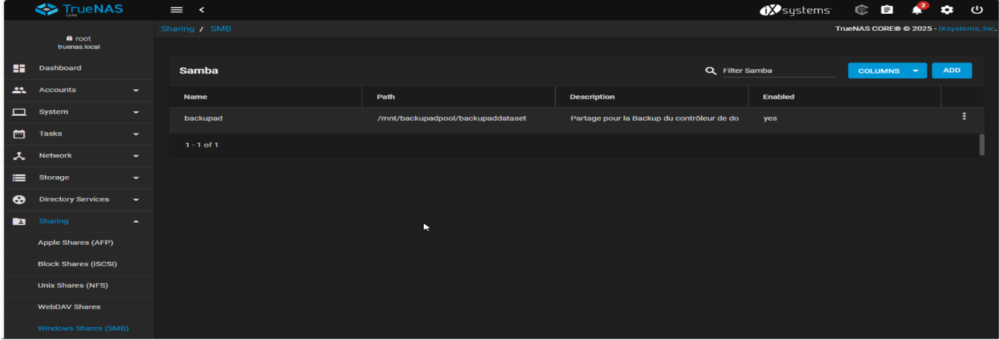

### Partage SMB activé
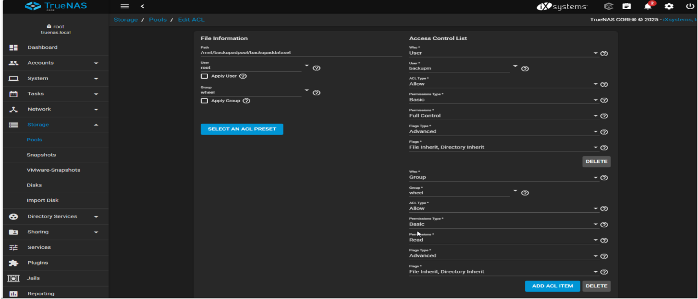

### Installation de Windows Server Backup
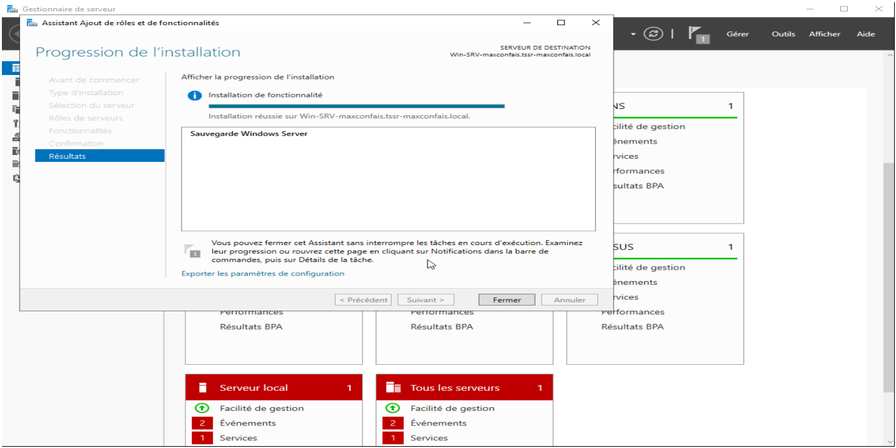

### Choix d'une sauvegarde complète
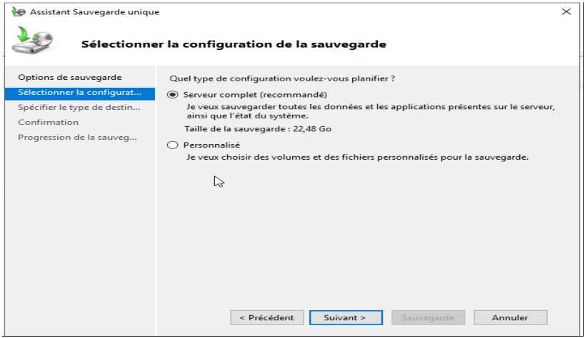

### Choix du dossier partagé distant
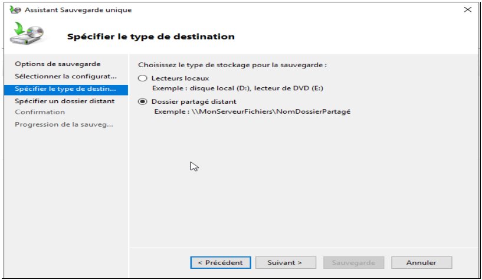

### Sauvegarde en cours
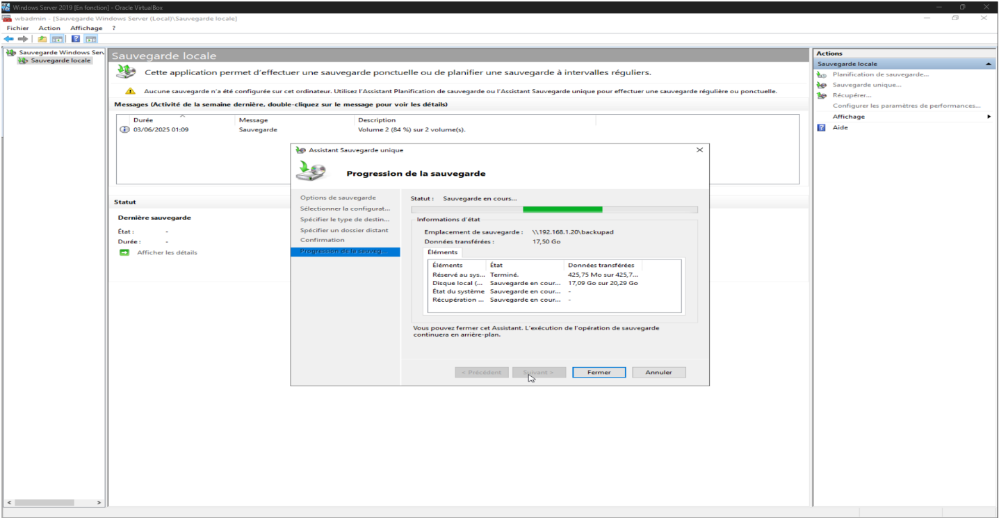

### Sauvegarde terminée avec succès
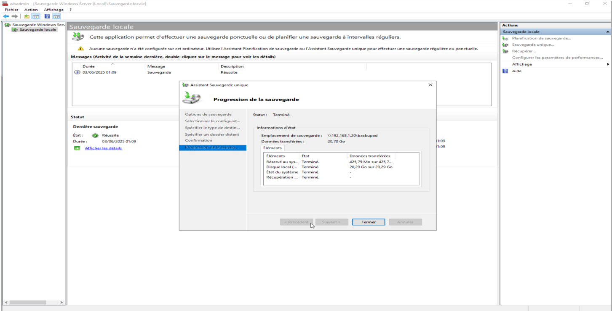

### Présence des fichiers sur le partage
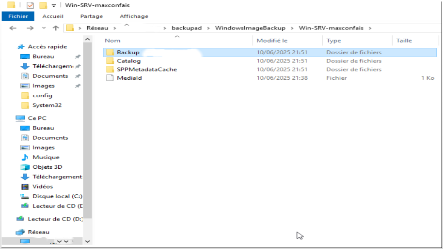

### Vérification de l’espace utilisé sur TrueNAS
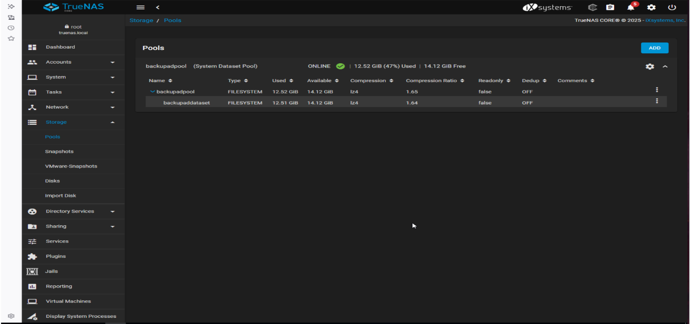

---

## Compétences mobilisées
- Administration Windows Server
- Sauvegarde et restauration
- NAS / stockage réseau
- ZFS
- SMB
- Gestion des permissions
- Virtualisation
- Documentation technique

---

## Limites du projet
- Le dépôt repose sur la documentation du lab initial
- Les machines virtuelles ne sont plus disponibles
- La partie restauration n’a pas été rejouée dans une nouvelle infrastructure

---

## Améliorations possibles
- Ajouter un scénario complet de restauration
- Planifier des sauvegardes automatiques
- Mettre en place une supervision du stockage
- Ajouter des alertes en cas d’échec
- Étendre le projet à plusieurs serveurs

---

## Auteur
**Max Confais**
